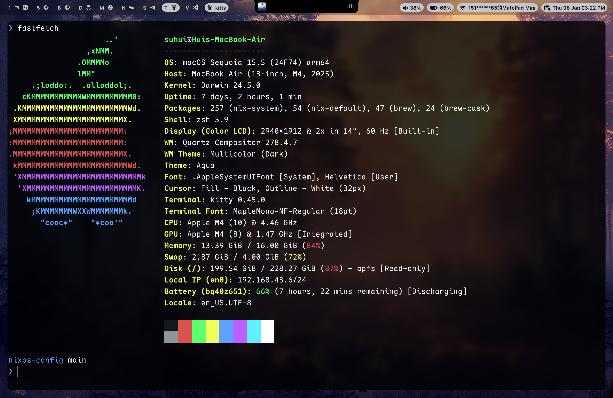

# Nix Configuration

这份配置基于 [Crabtux](https://github.com/Crabtux) 的配置进行修改，旨在为 macOS (使用 nix-darwin) 和 NixOS 提供统一且高效的开发环境。

## 概览

本项目包含两套主要的系统配置：

- **macOS (`macos`)**: 适用于 Apple Silicon (aarch64-darwin) 的 nix-darwin 配置。
- **NixOS (`lenovo`)**: 适用于 Lenovo 笔记本 (x86_64-linux) 的 NixOS 配置，包含 Nvidia 显卡支持。

## 截图

### macOS (nix-darwin)




### NixOS


## 目录结构

- `flake.nix`: 项目入口，定义了系统和 Home Manager 的配置。
- `hosts/`: 不同主机的具体配置入口。
  - `lenovo/`: NixOS 配置。
  - `macos/`: Darwin 配置。
- `modules/`: 可复用的模块。
  - `darwin/`: macOS 专属系统模块。
  - `nixos/`: NixOS 专属系统模块。
  - `home-manager/`: 用户级软件和点文件配置 (Neovim, Zsh, Kitty, Tmux 等)。
- `profiles/`: 通用配置文件集。
- `pkgs/`: 自定义软件包。
- `overlays/`: Nixpkgs 覆盖层。

## 配置哲学

本项目采用了自定义的 `rain` 抽象层，通过 NixOS/Home Manager 的 `Option` 系统来实现高度模块化的配置管理：

- **`rain` 抽象层**: 将复杂的系统配置封装在 `modules/*/rain` 下，为 macOS 和 NixOS 提供了一套统一的配置接口。
- **声明式开关 (`mkIf`)**: 所有的功能模块（如 `aerospace`, `sketchybar`, `nvim` 等）都通过 `mkOption` 定义了开关或参数。在具体主机的配置中，只需通过 `rain.xxx.enable = true` 即可按需开启功能。
- **解耦与复用**: 这种做法使得底层实现（如何安装软件、如何配置点文件）与高层逻辑（哪些机器需要哪些功能）完全解耦，极大地提高了配置的可维护性和跨平台复用能力。

## 使用方法

### macOS

构建并切换到新配置：

```bash
darwin-rebuild switch --flake .#macos
```

### NixOS

构建并切换到新配置：

```bash
sudo nixos-rebuild switch --flake .#lenovo
```

## 许可证

本项目采用 MIT 许可证。详情请参阅 [LICENSE](./LICENSE) 文件。
